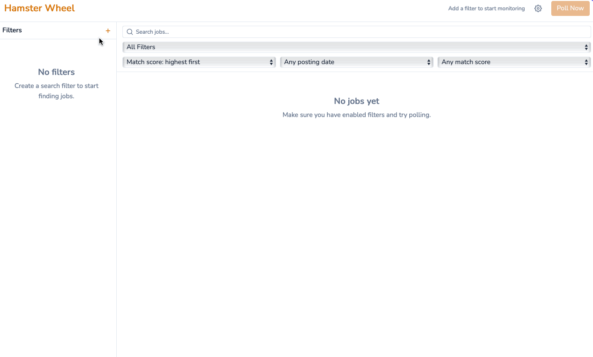

# Hamster Wheel

**Self-hosted job-search assistant.** Polls job boards in the background, deduplicates listings, and uses an LLM to score each one against your CV — so you see real matches, not noise.



## What it is

Manual job hunting is repetitive and time-sensitive. The early applicant has an edge, but refreshing search pages every hour is a poor use of a person. Hamster Wheel polls the boards on a schedule, persists every new listing to a local database, and scores each one against your CV using an LLM — either OpenAI in the cloud, or a Llama model running fully offline on your machine.

Unlike paid aggregators or job-site email alerts, Hamster Wheel runs as a desktop app you control. There is no cloud backend, no account, and no telemetry. Your CV is parsed in-process and only the parts the matcher needs are sent to the LLM endpoint *you* configured. Pick the local Llama runtime and it never leaves the machine at all.

## Install

### Pre-built (recommended)

Download the latest installer from [Releases](https://github.com/jmpdevelopment/hamster-wheel/releases):

| Platform | File |
|---|---|
| macOS (Apple Silicon + Intel) | `hamster-wheel-<version>-macos-installer.dmg` |
| Windows 10/11 (x64) | `hamster-wheel-<version>-windows-installer.exe` |

Builds are not yet code-signed. On macOS, right-click the app → *Open* on first launch to bypass Gatekeeper. On Windows, click *More info* → *Run anyway* on the SmartScreen prompt. Verify downloads against the SHA256 checksums published with each release.

### Build from source

Requires Go 1.25+, Node 20+, and the [Wails v3 CLI](https://v3.wails.io/getting-started/installation/) (`go install github.com/wailsapp/wails/v3/cmd/wails3@latest`).

```bash
git clone https://github.com/jmpdevelopment/hamster-wheel.git
cd hamster-wheel
cd frontend && npm install && cd ..
wails3 dev
```

For installer packaging, see [scripts/installers/README.md](scripts/installers/README.md).

## Getting started

Two paths, depending on how much you want leaving your machine.

### Cloud setup (fastest)

1. Get a free Reed API key at <https://www.reed.co.uk/developers>.
2. Get an OpenAI API key at <https://platform.openai.com/api-keys>.
3. Launch the app. The first-run wizard walks you through:
   - Pasting both keys (stored in the OS keychain).
   - Setting the polling interval (default 30 minutes) and job retention (default 30 days).
   - Picking the OpenAI model (default `gpt-4o-mini`).
4. Create at least one search filter (keywords + location), then **Poll Now**. New jobs appear immediately; match scores fill in within a few seconds each.

### Fully local setup

1. Install [Ollama](https://ollama.com), launch it once so it registers itself, then quit it.
2. Get a free Reed API key at <https://www.reed.co.uk/developers>.
3. Launch Hamster Wheel. In the wizard:
   - Add the Reed key.
   - Choose **LLM mode → Local**, click **Start runtime**, then **Download Llama** (~4.7 GB, one-time).
   - Wait for the runtime to reach *ready*.
4. Create a filter and **Poll Now**. Matching takes longer than Cloud (CPU/GPU dependent) but nothing leaves your machine.

You can switch between Cloud and Local at any time from **Settings → LLM Providers** without restarting the app.

## How matching works

Polling and matching are decoupled. The scheduler fetches jobs and writes them to SQLite immediately; a separate worker pulls pending jobs off the queue and scores them. Slow LLM responses never delay job discovery, and you can disable matching entirely if you only want raw polling.

Each match request sends the LLM your job filter, the listing's title/company/location/description, and a compact summary of your CV. The model returns a score from 0.0 to 1.0 and a one-paragraph rationale. Recalculate any job's score after editing your CV, or bulk-recalculate from the right-click menu in the job list.

If a match fails (rate limit, parse error, network drop), the job stays in the list with a *failed* badge — you can retry it without losing the discovery.

## Privacy

Hamster Wheel makes no analytics or telemetry calls. The only outbound traffic is to the job-board APIs and the LLM endpoint you configured.

API keys live in the OS keychain (Keychain on macOS, Credential Manager on Windows), never in the SQLite database or in plaintext config. Job data is stored locally in your user data directory. CV files are read from disk and parsed in-process; the parsed text is included in match prompts only.

Choose **Local** mode and the LLM endpoint is `localhost` — your CV and the job descriptions you score never reach a third party.

## Tech stack

Go 1.25, [Wails v3](https://v3.wails.io), [modernc.org/sqlite](https://pkg.go.dev/modernc.org/sqlite) (pure-Go, no CGO), [zalando/go-keyring](https://github.com/zalando/go-keyring), React 18 + TypeScript + Vite + Tailwind. LLM integration is OpenAI-first with an OpenAI-compatible local-runtime path via Ollama.

See [docs/](docs/) — particularly [architecture.md](docs/core/architecture.md) and [decisions.md](docs/core/decisions.md) — for deeper detail on the runtime model and accepted decisions.

## License

[MIT](LICENSE)
