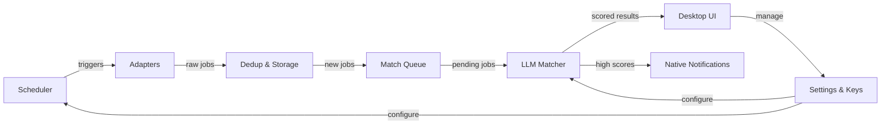

# Hamster Wheel

Job search monitoring with LLM-powered matching

## Overview

Hamster Wheel is a self-hosted desktop application (macOS & Windows) built with Wails v3. It runs in the background, polls job boards at configurable intervals, deduplicates and stores results locally in SQLite, and scores each posting against your CV using an AI model (cloud or local LLM). When a high-quality match is found, you get a native desktop notification. CV and cover-letter tailoring workflows are planned for a future phase.

## Architecture



- The **Scheduler** polls enabled filters at configurable intervals
- **Adapters** fetch jobs from source APIs (extensible via adapter pattern)
- New jobs are **deduplicated** and stored in local SQLite
- Discovered jobs enter a **match queue** for async LLM scoring
- The **LLM Matcher** scores job fit against the user's CV (cloud or local provider)
- **High-score matches** trigger native desktop notifications
- All configuration (API keys, intervals, thresholds) managed through **Settings**, with keys stored in OS keychain

Built with Go, Wails v3, React/TypeScript, and SQLite. See [`docs/core/architecture.md`](docs/core/architecture.md) for the full technology stack.

## Features

- Automatic job-board polling in the background — no manual searching
- LLM-powered match scoring against your CV (cloud or local model)
- Native desktop notifications when a high-quality match is found
- Fully local: no cloud backend, no telemetry, no user accounts
- API keys stored securely in the OS keychain

## Prerequisites

- Go 1.25+
- Node.js (for frontend)
- Wails v3 CLI

## Getting Started

```bash
# Clone the repository
git clone https://github.com/jmpdevelopment/hamster-wheel.git
cd hamster-wheel

# Install frontend dependencies
cd frontend && npm install && cd ..

# Run in development mode
./dev-run.sh
```

## Building Installers

Windows (NSIS) and macOS (pkg/dmg) installer instructions are in [`scripts/installers/README.md`](scripts/installers/README.md).

## Documentation

Detailed architecture, product, and engineering docs live in [`docs/`](docs/). For AI agent context (documentation contract, read order, and minimal context packs) see [`docs/AI_CONTEXT.md`](docs/AI_CONTEXT.md).

## Current Status

Phase 1 (foundation + polling) is complete. Phase 2 (LLM matching) is in progress. See [`docs/execution/status.md`](docs/execution/status.md) and [`docs/execution/roadmap.md`](docs/execution/roadmap.md) for details.

## License

Apache 2.0
