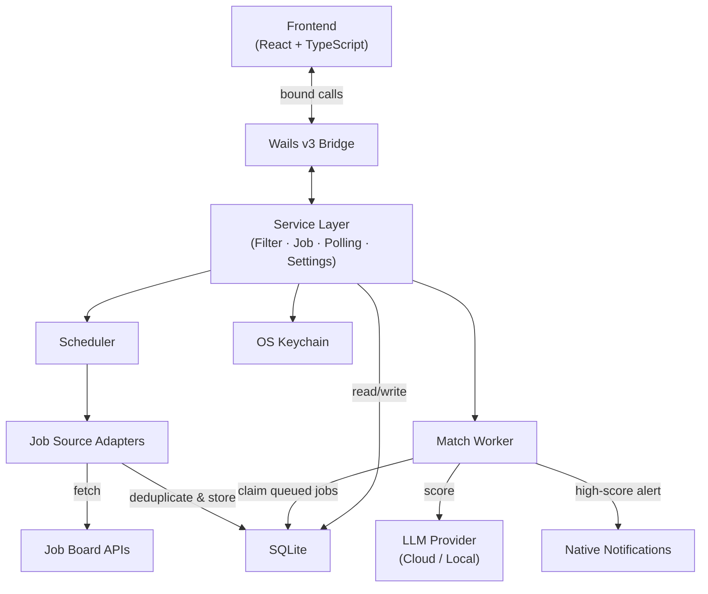

# Hamster Wheel

Job search monitoring with LLM-powered matching

## Overview

Hamster Wheel is a self-hosted desktop application (macOS & Windows) built with Wails v3. It runs in the background, polls job boards at configurable intervals, deduplicates and stores results locally in SQLite, and scores each posting against your CV using an AI model (cloud or local LLM). When a high-quality match is found, you get a native desktop notification. CV and cover-letter tailoring workflows are planned for a future phase.

## Features

- Background job-board polling with configurable intervals
- LLM-powered job matching (OpenAI cloud, local models, or OpenAI-compatible endpoints)
- Native desktop notifications for high-score matches
- Local SQLite storage — no cloud backend required
- OS keychain integration for API key storage
- Extensible adapter pattern for job sources
- Privacy-first: no telemetry, no user accounts

## Architecture

The application follows a layered architecture with clear separation between the frontend UI, Wails-bound service layer, and internal packages. Polling and matching are intentionally decoupled so ingestion stays fast and deterministic while LLM scoring runs asynchronously.



**Data flow:** The scheduler triggers enabled filters on a configurable interval. Each adapter fetches jobs from its source API, deduplicates by `(source, source_id)`, and persists new results. Newly discovered jobs are queued for asynchronous matching. The match worker atomically claims pending jobs, scores them via the configured LLM provider, and fires native notifications for high-score matches. The UI reflects state changes in real time.

For the full technology stack, data model, and service boundary details see [`docs/core/architecture.md`](docs/core/architecture.md).

## Prerequisites

- Go 1.25+
- Node.js (for frontend)
- Wails v3 CLI

## Getting Started

```bash
# Clone the repository
git clone https://github.com/jmpdevelopment/hamster-wheel.git
cd hamster-wheel

# Install frontend dependencies
cd frontend && npm install && cd ..

# Run in development mode
./dev-run.sh
```

## Building Installers

Windows (NSIS) and macOS (pkg/dmg) installer instructions are in [`scripts/installers/README.md`](scripts/installers/README.md).

## Documentation

Detailed architecture, product, and engineering docs live in [`docs/`](docs/). For AI agent context (documentation contract, read order, and minimal context packs) see [`docs/AI_CONTEXT.md`](docs/AI_CONTEXT.md).

## Current Status

Phase 1 (foundation + polling) is complete. Phase 2 (LLM matching) is in progress. See [`docs/execution/status.md`](docs/execution/status.md) and [`docs/execution/roadmap.md`](docs/execution/roadmap.md) for details.

## License

Apache 2.0
